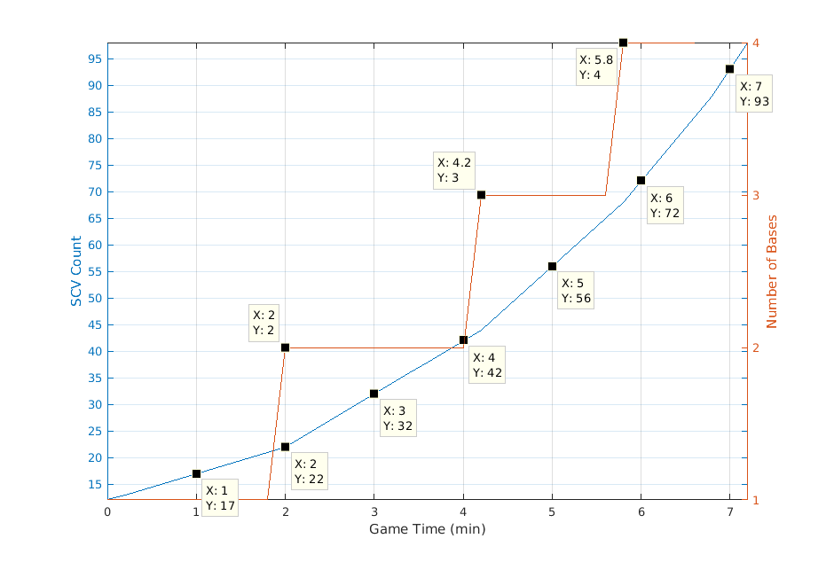
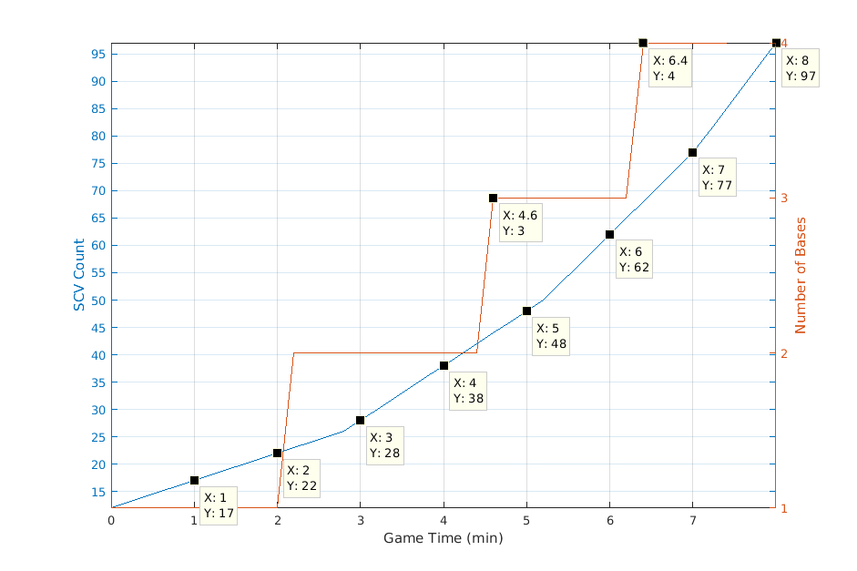
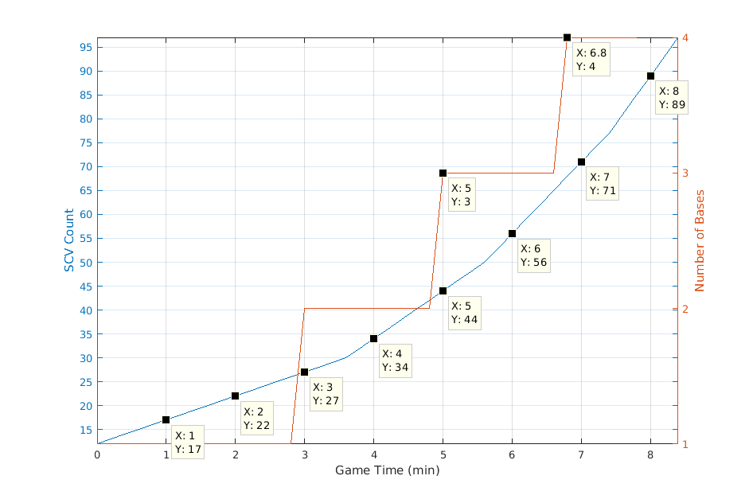
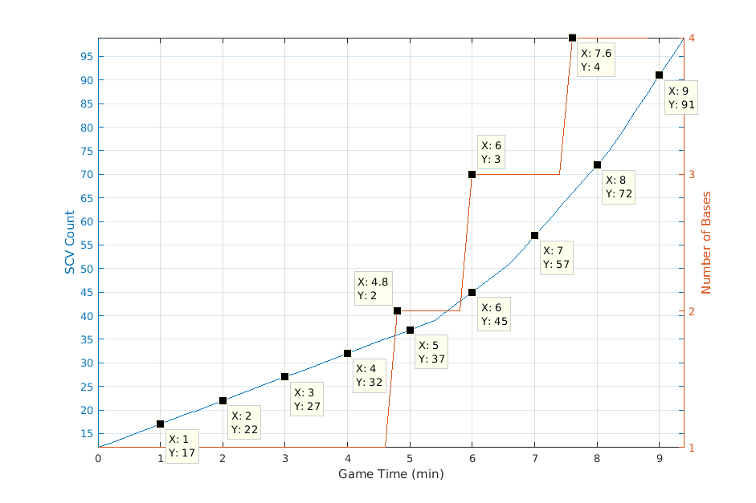

# Expansion Timing and Worker Count

These notes detail when you should build your expansion
and the worker counts you should have over
game time.  The analysis assumes that expansions
should be built such that when the
expansion finishes, all your previous
bases are fully saturated (2 SCVs/mineral
and 3 SCVs/gas) under constant worker production
and full gas saturation.  There are 8 mineral
patches and 2 gas geysers so 22 SCVs are needed
per base for full saturation.  Terran starts with
12 SCVs and the build time of each SCV is 12
seconds.  The build time for a command center
is 71 seconds.  It takes an additional 25 seconds to
convert it to an orbital command.  For the sake of petty humans,
it is assumed SCVs are made synchronously at
12 seconds increments.

## Perfect Expansion Timing

The perfect expansion timing assumes that
expansions start building such that
when they finish, all previous bases are
saturated under constant worker production.

Base | Start Construction
---- | ------------------
 2   | 00:49
 3   | 03:25
 4   | 05:01
 5   | 06:25

## Expansion First
Perfect expansion timing is impossible to achieve
because its impossible to get a command center
down at 00:49 while constantly producing SCVs.
With a CC first build the fastest you can get a
command center down is at 01:00.

Base | Start Construction
---- | ------------------
 2   | 01:00
 3   | 03:25
 4   | 05:13
 5   | 06:25

## Reaper Expand
A CC first could be dangerous if you were
getting all-in'd.  A reaper expansion
(depot, rax, gas, CC) gives you the ability
to scout the opponent at the cost of a
delayed expansion.

Base | Start Construction
---- | ------------------
 2   | 01:45
 3   | 03:49
 4   | 05:37
 5   | 06:49

## 1-1-1 Builds
1-1-1 builds give expos at approx 3:30.

Base | Start Construction
---- | ------------------
 2   | 03:37
 3   | 04:49
 4   | 06:25
 5   | 07:49

