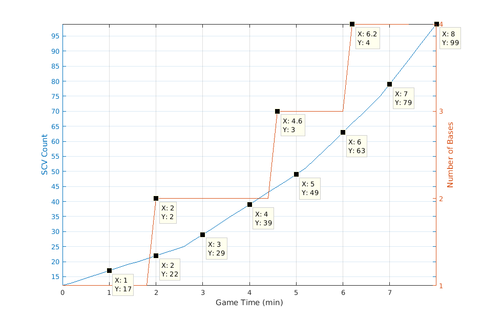

# Expansion Timing and Worker Count

These notes detail the absolute latest
you should have your expansion at and
the worker counts you should have over
game time.  It assumes that expansions
should be built such that when the
expansion finishes, all your previous
bases are fully saturated (2 SCVs/mineral
and 3 SCVs/gas) under constant worker production
and full gas saturation.  There are 8 mineral
patches and 2 gas geysers so 22 SCVs per base
for full saturation.  Terran starts with
12 SCVs and the build time of each SCV is 12
seconds.

## Worst Case

The worst case expansion timing assumes that
expansions start building such that
when it finishes, all previous bases are
saturated under constant worker production.

Base | Start Construction
---- | ------------------
 1   |  
 2   | 
 3   | 
 4   | 

## Reaper Expand
